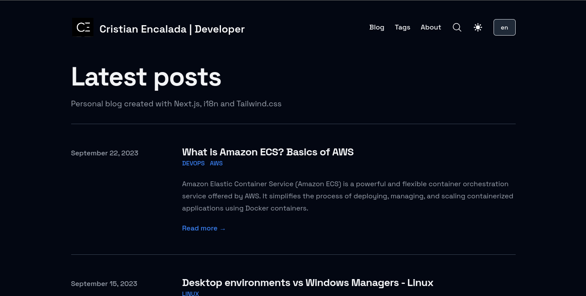
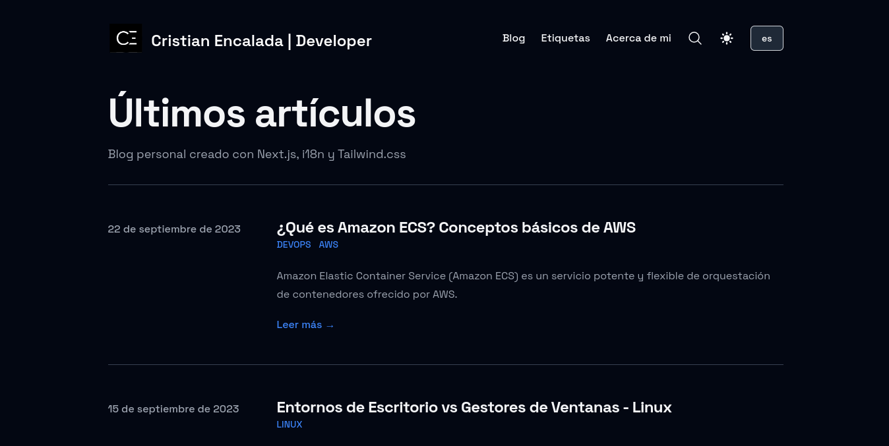
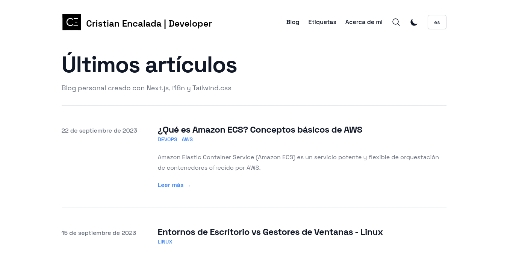

[](./LICENSE)

  
# Personal Blog

Project built with Next.js, TailwindCSS & TypeScript.

## English view



## Spanish view



## Dark/Light mode


  
## Demo

[](https://cristianencalada-blog.vercel.app/)

## Run Project

This repository uses **Yarn** (see `yarn.lock` and `.yarn/releases/`). Use Yarn for installs and scripts; do not use `npm install` or `npm ci` here.

```bash
yarn && yarn dev
```

Other common commands:

```bash
yarn build
yarn lint
```

### OpenSpec (optional)

[OpenSpec](https://github.com/Fission-AI/OpenSpec) is a dev dependency. This repo uses Yarn Classic (no `yarn dlx`); run the CLI with:

```bash
yarn openspec --help
```
    
## Contributing

Contributions are always welcome!

Fork repo, make changes, test, create a pull request.

Please make sure to maintain `authorship`.

  
## Credits

- [@timlrx](https://github.com/timlrx/tailwind-nextjs-starter-blog) - Original author
- [@PxlSyl](https://github.com/PxlSyl/pablo-pikassiet-next-starter-i18n) - Added internationalization support.
  
## License

[MIT](./LICENSE)

  